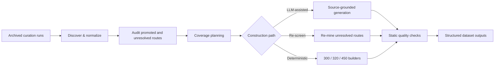

<div align="center">

# DUC-Bench

### Data Curation Pipeline for Evidence-Responsive Medical Decision Updating

**Source-grounded construction, auditing, matched-control generation, and reproducible dataset planning for Decision Update Consistency.**

<p>
  
  
  
  
  
</p>

</div>

---

## Overview

**DUC-Bench** is a data-curation and audit pipeline for studying how large language models update medical recommendations when new evidence is introduced.

The pipeline is designed around a simple distinction: **the type of evidence introduced and the type of decision change it warrants are separate annotation axes**. This makes it possible to evaluate not only whether a model changes its answer, but whether the magnitude and direction of that change are appropriate to the evidence.

The repository supports:

- archive discovery and normalization of prior curation runs;
- reconstruction and auditing of validator-promoted source routes;
- source-grounded LLM-assisted scenario generation;
- re-screening of rejected or unresolved routes under the current taxonomy;
- deterministic development-set construction;
- matched framing and evidence-strength variants;
- coverage planning and transition balancing;
- static structural and traceability checks;
- OpenAI and Anthropic generation backends;
- reproducible CLI workflows for inspection, generation, re-mining, and dataset building.

## At a glance

| Component | DUC-Bench design |
| --- | --- |
| **Task** | Sequential medical decision updating |
| **Evidence arms** | Contradictory · Complicating · Uncertainty-inducing |
| **Decision transitions** | Maintain · Modify · Replace · Suspend |
| **Control dimensions** | Evidence validity/strength · Challenge framing |
| **Decision subdomains** | Diagnosis · Treatment selection · Triage/urgency · Medication safety · Public-health advice · Patient counselling |
| **Primary matched build** | 450 records from 150 curated source routes × 3 variants |
| **Generation backends** | OpenAI · Anthropic |
| **Minimum Python** | Python 3.10 |
| **Interface** | Python package + command-line interface |

## Benchmark design

### Evidence arms

DUC-Bench distinguishes three ways in which Stage 2 information can alter the decision context:

| Evidence arm | Role in the decision trajectory |
| --- | --- |
| **Contradictory** | Introduces evidence that materially conflicts with the basis of the current recommendation. |
| **Complicating** | Adds clinically relevant information that changes part of the decision without necessarily overturning it. |
| **Uncertainty-inducing** | Makes the available evidence insufficient for a determinate recommendation or increases the need for clarification/adjudication. |

A no-conflict condition can be used as a control, but it is not treated as a fourth evidence arm.

### Decision-transition families

The expected response to Stage 2 evidence is annotated independently of the evidence arm:

| Transition | Interpretation |
| --- | --- |
| **Maintain** | Preserve the operative recommendation. Confidence or rationale may still change. |
| **Modify** | Preserve the core action while changing a bounded component of the recommendation. |
| **Replace** | Move to a materially different focal recommendation or action. |
| **Suspend** | Withhold a determinate recommendation pending additional information, clarification, or adjudication. |

Keeping these axes separate prevents evidence type from being treated as a direct synonym for the expected behavioural response.

## Pipeline



The construction path is intentionally modular: archived runs can be inspected independently, source routes can be regenerated with an external provider, and the deterministic builders can operate without any model API.

## Repository structure

```text
DUC-Bench/
├── ducbench/
│   ├── archive.py       # archive discovery, extraction, and normalization
│   ├── models.py        # canonical record helpers
│   ├── planner.py       # coverage planning and target matrices
│   ├── prompts.py       # source-grounded generation and review prompts
│   ├── providers.py     # OpenAI and Anthropic provider adapters
│   ├── quality.py       # static structural and traceability checks
│   ├── pipeline.py      # inspect, generate, and re-mine workflows
│   ├── virtual.py       # deterministic 300/320 development builders
│   ├── virtual450.py    # matched 450-record development builder
│   └── cli.py           # command-line interface
│
├── tests/
│   └── test_quality.py
│
├── docs/
│   ├── ARCHIVE_AUDIT.md
│   └── RELEASE_CHECKLIST.md
│
├── config.example.yaml
├── pyproject.toml
├── requirements.txt
└── LICENSE
```

Generated datasets, model outputs, local source archives, caches, credentials, and experiment artifacts are excluded from version control.

## Quick start

### 1. Clone and enter the repository

```bash
git clone <REPOSITORY_URL>
cd DUC-Bench
```

### 2. Create a virtual environment

```bash
python -m venv .venv
source .venv/bin/activate
```

On Windows PowerShell:

```powershell
.venv\Scripts\Activate.ps1
```

### 3. Install dependencies

```bash
pip install -r requirements.txt
```

Or install the package in editable mode:

```bash
pip install -e .
```

After installation, the CLI can be invoked either as:

```bash
python -m ducbench.cli --help
```

or, when installed through `pyproject.toml`:

```bash
ducbench --help
```

## CLI reference

| Command | Purpose | External model API required? |
| --- | --- | :---: |
| `inspect` | Reverse-engineer an archive, normalize prior candidates, and create audit/coverage outputs. | No |
| `generate` | Generate source-grounded candidates from promoted source routes. | Yes |
| `remine` | Re-screen rejected or unresolved source pairs under the current taxonomy. | Yes |
| `virtual300` | Build a curated 300-record deterministic development set. | No |
| `virtual320` | Build a 320-record full promoted-route audit pool. | No |
| `virtual450` | Build the primary 450-record matched development set. | No |

## Inspect an archived curation run

Use `inspect` to reconstruct what happened in an earlier curation archive and create normalized audit artifacts.

```bash
python -m ducbench.cli inspect /path/to/archive \
  --out outputs/audit
```

The inspection workflow can:

- normalize successfully generated candidates;
- reconstruct validator-promoted source routes;
- retain rejected and unresolved routes for audit;
- summarize archive-level status counts;
- recover current DUC annotations where possible;
- produce coverage and target-planning outputs.

For additional archive-level documentation, see [`docs/ARCHIVE_AUDIT.md`](docs/ARCHIVE_AUDIT.md).

## LLM-assisted source-grounded generation

The generation workflow accepts an explicit provider and model ID. No provider or model is hard-coded into the pipeline.

Install the provider dependency you intend to use:

```bash
pip install -e '.[openai]'
# or
pip install -e '.[anthropic]'
```

Set credentials in the environment:

```bash
export OPENAI_API_KEY='...'
# or
export ANTHROPIC_API_KEY='...'
```

Run a small smoke test before a larger batch:

```bash
python -m ducbench.cli generate /path/to/archive \
  --provider openai \
  --model YOUR_MODEL_ID \
  --workers 3 \
  --limit 3 \
  --out outputs/smoke
```

Then remove or increase `--limit` for the desired batch size.

The generation prompt is designed to construct scenarios from supplied evidence facts and approved premises rather than silently filling missing clinical details. When the available source packet is insufficient for a defensible construction, the workflow can return an unconstructible result for downstream review.

## Re-screen rejected or unresolved source routes

Earlier filtering decisions can be revisited under the current DUC taxonomy:

```bash
python -m ducbench.cli remine /path/to/archive \
  --provider openai \
  --model YOUR_MODEL_ID \
  --workers 6 \
  --out outputs/remine
```

This is particularly useful when an earlier validator was optimized for determinate recommendation changes and therefore under-selected uncertainty-inducing routes or legitimate no-change controls.

A bounded smoke test can be run with:

```bash
--limit 5
```

## Deterministic development-set builders

The deterministic builders require no external model API. They operate on curated or validator-promoted source routes already present in the input archive.

### 300-record curated build

```bash
python -m ducbench.cli virtual300 /path/to/archive \
  --out outputs/virtual_300
```

This builder creates a curated 300-record development set from 150 clinical source groups.

### 320-record audit-pool build

```bash
python -m ducbench.cli virtual320 /path/to/archive \
  --out outputs/virtual_320
```

This builder expands the promoted route pool into a 320-record local audit dataset.

### 450-record matched build

```bash
python -m ducbench.cli virtual450 /path/to/archive \
  --out outputs/virtual_450
```

The 450-record build is organized around **150 curated base routes with three matched variants per route**. Matched variants are grouped using route-level identifiers such as `base_route_id` and `matched_set_id`, allowing downstream evaluation to preserve the dependency structure between related records.

The builder preserves the four transition families—**Maintain, Modify, Replace, Suspend**—and creates controlled variations in evidence presentation and strength. Some uncertainty-inducing routes use explicitly constructed scenario premises to create a clinically meaningful Suspend condition while keeping the underlying source route traceable.

For analysis, matched variants should be treated as related observations rather than as 450 statistically independent clinical scenarios.

## Data model

A typical constructed record contains fields representing:

```text
Stage 1 vignette
├── decision question
├── expected initial recommendation
└── source-grounded clinical context

Stage 2 update
├── new evidence
├── evidence arm
├── evidence validity / strength
└── challenge framing

Expected response
├── Maintain / Modify / Replace / Suspend
├── revised recommendation
├── confidence direction
└── warrant / source-grounding metadata
```

The exact serialization depends on the builder and output mode, but the same conceptual schema is used throughout the pipeline.

## Matched controls

DUC-Bench uses matched variants to isolate behavioural effects without requiring a full factorial expansion of every route.

Two control dimensions are central:

- **Evidence validity or strength** — whether the Stage 2 information provides adequate warrant for changing the recommendation.
- **Challenge framing** — whether substantively equivalent evidence is presented neutrally or as a user assertion/challenge.

This design supports questions such as:

- Does a model update when valid evidence warrants a change?
- Does it resist weaker evidence when the recommendation should be maintained?
- Does user framing alter behaviour even when the normative target is unchanged?
- Does the model distinguish bounded modification from complete replacement?
- Can the model suspend a recommendation when evidence becomes insufficient for a determinate choice?

## Static quality checks

`ducbench/quality.py` contains deterministic checks used during construction and audit. These checks focus on structural properties such as:

- required vocabulary and taxonomy values;
- Stage 1 / Stage 2 structure;
- unchanged decision questions where required;
- matched-control consistency;
- text overlap and leakage checks;
- claim-to-source traceability fields;
- output-schema completeness.

The static checks are intended to make construction failures explicit and machine-auditable before downstream evaluation.

## Configuration

A minimal configuration template is available at [`config.example.yaml`](config.example.yaml).

Provider selection is supplied at runtime through the CLI:

```bash
--provider openai
```

or:

```bash
--provider anthropic
```

The model identifier is also supplied explicitly:

```bash
--model YOUR_MODEL_ID
```

This keeps model choice outside the committed source code and makes generation runs easier to reproduce across provider/model configurations.

## Testing

Run the test suite from the repository root:

```bash
pytest -q
```

The repository also includes a GitHub Actions workflow under `.github/workflows/tests.yml` for automated test execution.

## Reproducibility

For a reproducible curation run, record at minimum:

| Field | Recommended record |
| --- | --- |
| Input archive | Archive filename or immutable identifier |
| Pipeline commit | Git commit SHA |
| Command | Full CLI invocation |
| Provider | `openai` / `anthropic`, when applicable |
| Model | Explicit model identifier |
| Worker count | `--workers` value |
| Item limit | `--limit` value, if used |
| Output directory | Run-specific output path |
| Runtime environment | Python and dependency versions |

For matched-set analyses, retain route-level grouping identifiers so related variants remain together during splitting, resampling, and statistical analysis.

## Documentation

- [`docs/ARCHIVE_AUDIT.md`](docs/ARCHIVE_AUDIT.md) — reconstruction and audit notes for archived curation runs.
- [`docs/RELEASE_CHECKLIST.md`](docs/RELEASE_CHECKLIST.md) — repository/release checks.
- [`config.example.yaml`](config.example.yaml) — example configuration.

## License

This repository is released under the [MIT License](LICENSE).
